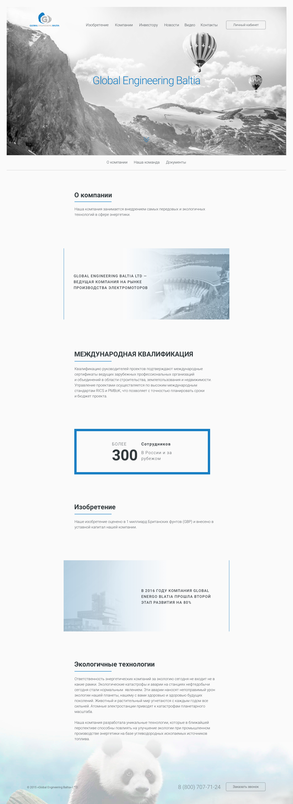
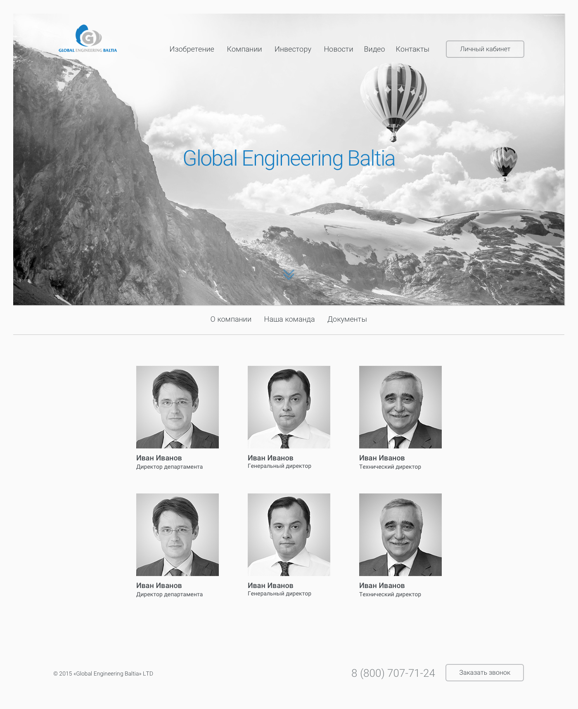

# Компания

1. О компании
	* Шапка
		* Заголовок — названи компании
	* Меню под шапкой
		* О компании
		* Наша команда
		* Документы
	* 1 Блок
		* Заголовок — «О компании»
		* Текст
	* 2 Блок
		* Заголовок — «GLOBAL ENGINEERING BALTIA LTD — ВЕДУЩАЯ КОМПАНИЯ НА РЫНКЕ ПРОИЗВОДСТВА ЭЛЕКТРОМОТОРОВ»
		* картинка
	* 3 Блок
		* Заголовок — «МЕЖДУНАРОДНАЯ КВАЛИФИКАЦИЯ»
		* Текст
	* 4 Блок
		* Заголовок — «Более 300 сотрудников в России и за рубежом»
	* 5 Блок
		* Заголовок — «Изобретение»
		* Текст
	* 6 Блок
		* Заголовок — «В 2016 ГОДУ КОМПАНИЯ GLOBAL ENGINEERING BALTIA ПРОШЛА ВТОРОЙ ЭТАП РАЗВИТИЯ НА 80%»
		* картинка
	* 7 Блок
		* Заголовок — «Экологичные технологии»
		* Текст
	* Футер
		* Картинка

#  О Компании

#  Наша Команда

#  Документы

