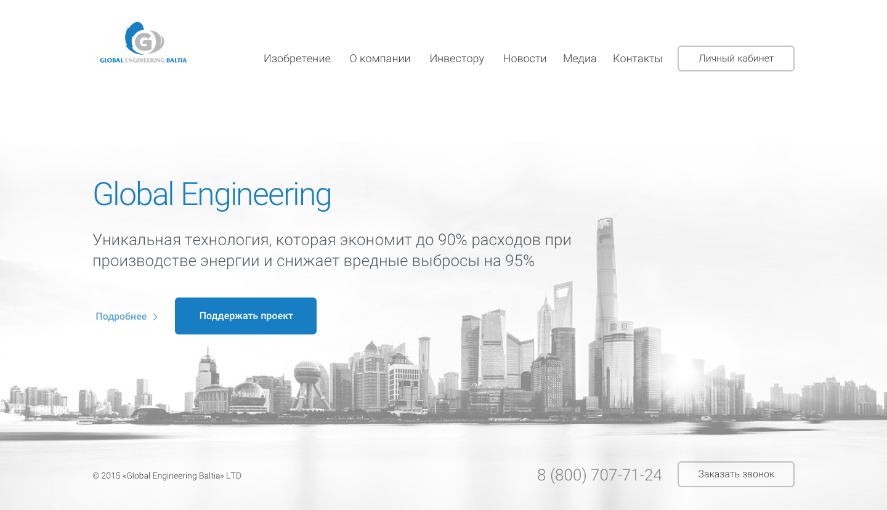
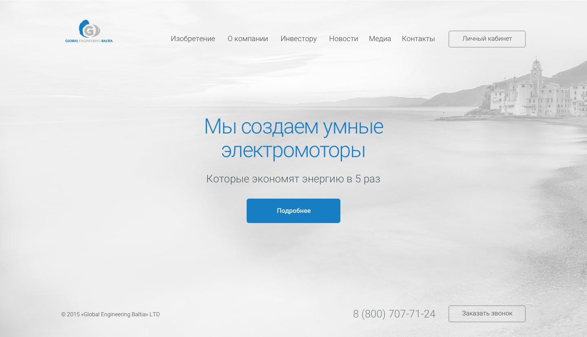
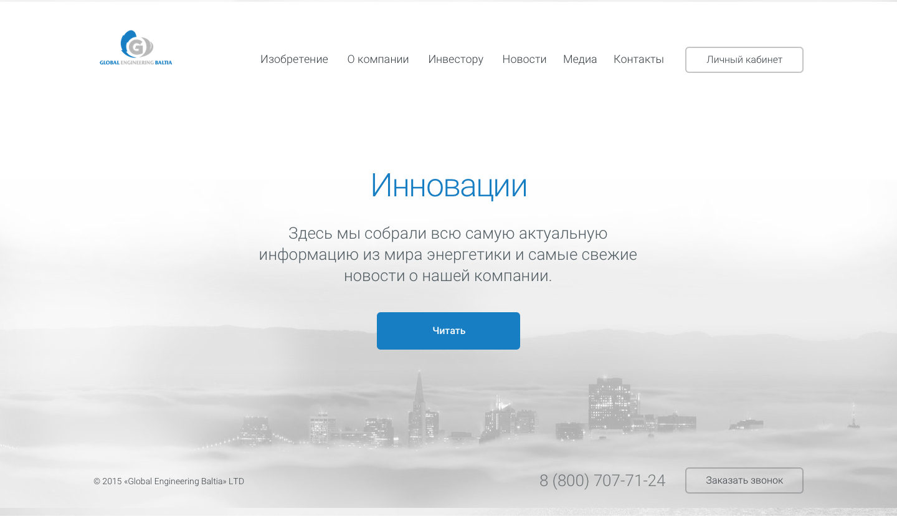

# Главная страница

1. Главная страница
	* Первый экран
		* Заголовок — названи компании
		* Текст раскрывающий суть компании
		* Кнопка «Подробнее» — ведет на страницу «О Компании»
		* Кнопка «Поддержать проект» — ведет на страницу «Личный кабинет»
	* Второй экран
		* Заголовок — «Мы создаем умные электромоторы»
		* Текст — раскрывает заголовок
		* Кнопка «Подробнее» — ведет на страницу «Изобретение»
	* Третий экран
		* Заголовок — «Инновации»
		* Текст
		* Кнопка «Читать» — ведет на страницу «Новости»

